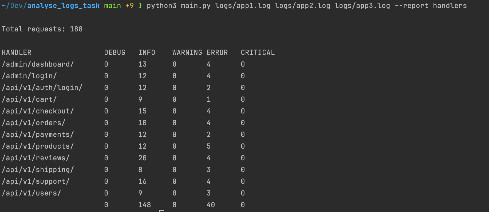

# Analyse Logs Task

CLI-приложение для анализа логов Django-приложений и генерации отчётов.  
Создано как решение тестового задания на позицию Python Junior.

---

## Как использовать

```bash
python3 main.py path/to/log1.log path/to/log2.log --report handlers
```

### Аргументы:
- `path/to/log*.log` — один или несколько путей к лог-файлам
- `--report handlers` — имя отчёта, который нужно сгенерировать

---

## Отчёт `handlers`

Генерирует статистику по каждому API-эндпоинту:
- по всем уровням логирования (`DEBUG`, `INFO`, `WARNING`, `ERROR`, `CRITICAL`)
- по каждому эндпоинту отдельно
- в конце — общее количество запросов

Пример:

```
Total requests: 1000

HANDLER                DEBUG   INFO    WARNING ERROR   CRITICAL
/admin/dashboard/      20      72      19      14      18
/api/v1/orders/        26      77      12      19      22
...
                       178     494     96      116     116
```

---

## Функциональность

- Обработка нескольких лог-файлов
- Объединение результатов
- Поддержка только нужных строк (`django.request`)
- CLI-интерфейс с проверками аргументов
- Удобная архитектура для расширения

---

## Тестирование

Проект покрыт тестами на `pytest`.

Запуск тестов:

```bash
pip install -r requirements.txt
```

Запуск тестов:

```bash
pytest
```

---

## Структура проекта

```
project/
├── main.py
├── parser/
│   └── log_parser.py
├── reports/
│   ├── handlers.py
├── tests/
│   ├── test_log_parser.py
│   ├── test_handlers.py
│   └── test_cli.py
```

---

## Пример вывода CLI

Скриншот отчёта по логам, предоставленным по [ссылке](https://drive.google.com/drive/folders/1zjkgC0iFkvikW1AtGSupT-0KIFdy7GuY):




